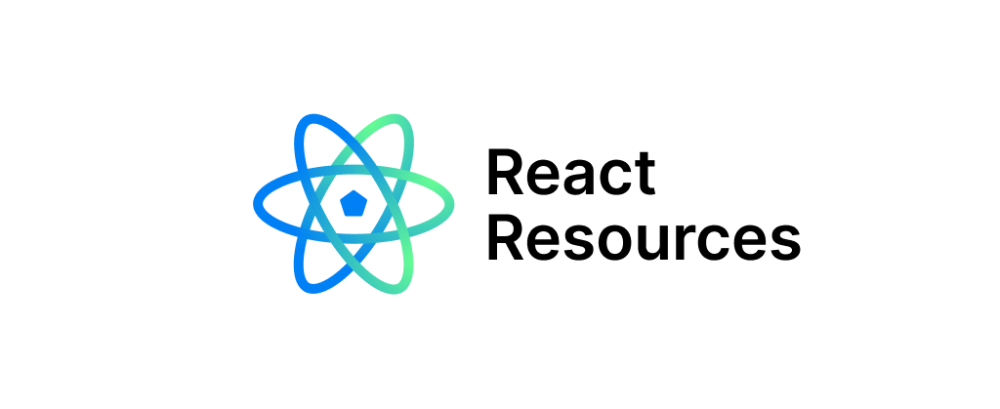
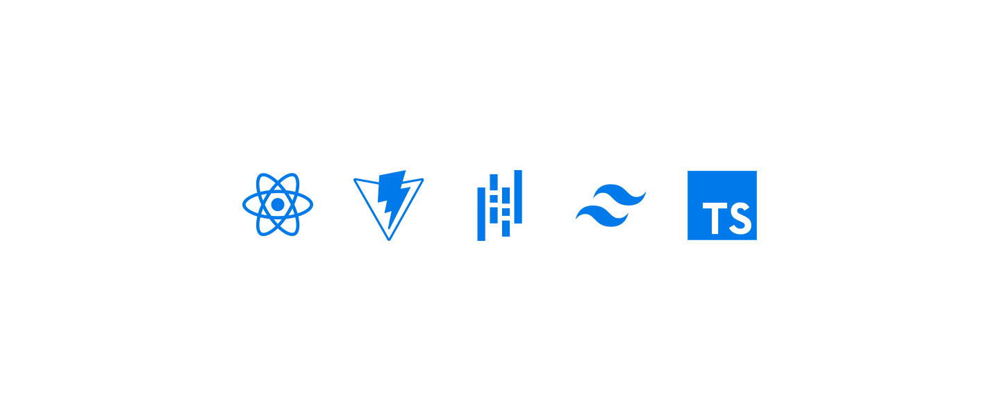

# React Resources

Welcome to the **React Resources** repository – your one-stop destination for curated and valuable resources to master React development! 🚀

## About

This web application is designed to help React developers of all levels discover high-quality resources that can enhance their skills and knowledge. 

## How to Contribute

1. Fork the repository.
2. Add your favorite React resources to the appropriate category.
3. Submit a pull request.
4. Join our community discussions and share your insights.

Let's work together to make React Resources the go-to hub for React developers worldwide!

## Development

This project is built with React Vite with TypeScript, for styles I use Tailwind CSS and also I use Pandas to tranform .cvs content to a JavaScript Object.

## Feedback

 Any feedback is awesome! If you have suggestions, encounter issues, or want to express appreciation, feel free to open an issue or reach out to me.

Happy coding! 🚀